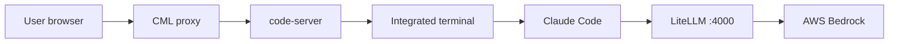

# Cloudera Blueprint: VS Code + Claude Code with AWS Bedrock

Custom ML runtime for **Cloudera AI Workbench / CML** that launches **VS Code in the browser** via [code-server](https://github.com/coder/code-server) and runs **[Claude Code](https://code.claude.com/docs/en/quickstart)** against **[Amazon Bedrock](https://aws.amazon.com/bedrock/)**—replacing CAII (Cloudera AI Inference) with inference in your AWS account.

## Table of Contents

- [Overview](#overview)
- [Use Case](#use-case)
- [Key Features](#key-features)
- [Quickstart](#quickstart)
- [Authentication (12-hour tokens)](#authentication-12-hour-tokens)
- [Recommended models](#recommended-models)
- [Architecture](#architecture)
- [Alternative: native Bedrock (no LiteLLM)](#alternative-native-bedrock-no-litellm)
- [Repository Structure](#repository-structure)
- [Prerequisites](#prerequisites)
- [Hardware Requirements](#hardware-requirements)
- [Troubleshooting](#troubleshooting)
- [Documentation](#documentation)

## Overview

This blueprint combines two workflows in one runtime:

1. **Browser VS Code** — edit project code, Git, extensions, and terminal under `/home/cdsw`, proxied like other CML editors (`ML_RUNTIME_EDITOR=VsCode`).
2. **Claude Code on Bedrock** — a local **LiteLLM** proxy translates Anthropic’s API to Bedrock’s Invoke API. Set `BEDROCK_MODEL` and AWS credentials in project env vars; run `claude-sync-config` then `claude` in the **VS Code integrated terminal** (or any session shell).

```
VS Code (browser)  →  integrated terminal  →  claude  →  LiteLLM (localhost:4000)  →  AWS Bedrock
```

No model runs inside the workbench pod—inference uses Bedrock in your AWS account.


Check out a short demo walkthrough here: (https://app.getreprise.com/present/Q6oxDZn)[https://app.getreprise.com/present/Q6oxDZn]

## Use Case

Teams on Cloudera AI want a **full IDE** plus **agentic coding** (shell, edits, search) without routing model traffic through Anthropic’s cloud API. This runtime keeps editing and agents on governed CML infrastructure while **model choice and credentials stay in AWS**.

**Primary outcome:** VS Code for day-to-day development and Claude Code for agent workflows, both on the same session, with Bedrock as the inference backend.

## Key Features

- **In-browser VS Code** via code-server on Workbench Python 3.13
- **Claude Code CLI** preinstalled with Bedrock-oriented settings (experimental betas disabled)
- **LiteLLM proxy** — Anthropic API → Bedrock Invoke API (same pattern as the [Claude Workbench with AWS Bedrock](https://github.com/kevinbtalbert/Claude-Workbench-with-AWS-Bedrock) blueprint)
- **Model from env** — `BEDROCK_MODEL` plus standard AWS credentials
- **12-hour Bedrock bearer tokens** — auto-minted from IAM keys or pasted from the Bedrock console
- **Pre-built image (already deployed)** — register `docker.io/kevintalbert/vsc-claude-bedrock:1.0.0` in the runtime catalog with no local Docker build; build from this repo only if you need a custom base or extra packages

## Quickstart

### 1. Enable Bedrock model access

In the AWS console:

1. Open **Amazon Bedrock → Model access** (or **Model catalog**) in your target region
2. Request access to your chosen Claude model (e.g. **Claude Sonnet 4**)
3. Create IAM credentials with `bedrock:InvokeModel` (and `bedrock:InvokeModelWithResponseStream` if streaming) on that model
4. Note the **model id** for `BEDROCK_MODEL` ([model IDs reference](https://docs.aws.amazon.com/bedrock/latest/userguide/model-ids.html))

### 2. Register the runtime

**Admin → Runtime Catalog → Add Runtime**

**Fast path (use the published runtime):** No build or push required—add this image URL in **Add Runtime**:

```text
docker.io/kevintalbert/vsc-claude-bedrock:1.0.0
```

Your cluster pulls the image from Docker Hub; ensure session workers can reach `docker.io` (or mirror the image internally if your policy requires it).

**Custom build:**

```bash
docker build --platform linux/amd64 --pull --rm \
  -f Dockerfile \
  -t <your-registry>/vsc-claude-bedrock:1.0.0 .

docker push <your-registry>/vsc-claude-bedrock:1.0.0
```

The image sets `ML_RUNTIME_EDITOR=VsCode`. Base image: `ml-runtime-pbj-workbench-python3.13-standard:2026.08.1-b5` — update `FROM` in `Dockerfile` if your cluster uses a different PBJ tag.

### 3. Start a session and open VS Code

Create a project with this runtime, start a session, and open **VS Code** from the workbench UI.

Optional: `CODE_SERVER_BIND` (default `127.0.0.1:8090`).

### 4. Set environment variables

**Project → Settings → Advanced → Environment Variables** → **Submit**, then **restart the session**.

**Required:**

| Name | Value |
|------|--------|
| `BEDROCK_MODEL` | Bedrock model id (e.g. `us.anthropic.claude-sonnet-4-6`) |
| `AWS_REGION` | Bedrock region (e.g. `us-east-1`) |

**Option A — Auto-refresh (recommended):**

| Name | Value |
|------|--------|
| `AWS_ACCESS_KEY_ID` | IAM or STS access key |
| `AWS_SECRET_ACCESS_KEY` | Secret key |
| `AWS_SESSION_TOKEN` | Required for temporary (STS) credentials |

**Option B — Manual token:** [Generate a short-term Bedrock API key](#authentication-12-hour-tokens), then set `AWS_BEARER_TOKEN_BEDROCK`.

Optional:

| Name | Default | Description |
|------|---------|-------------|
| `BEDROCK_LITELLM_PORT` | `4000` | Local LiteLLM proxy port |
| `BEDROCK_MAX_OUTPUT_TOKENS` | `8192` | Cap Claude Code output tokens |
| `BEDROCK_MAX_INPUT_TOKENS` | `192000` | Advertised input limit to LiteLLM |

If `BEDROCK_MODEL` does not start with `bedrock/`, the runtime prefixes it as `bedrock/invoke/<model>`.

### 5. Sync and run Claude Code

In the **VS Code integrated terminal** (or any interactive bash shell in the session):

```bash
claude-sync-config
claude
```

One-shot prompt:

```bash
claude -p "explain this repo"
```

| Command | Description |
|---------|-------------|
| `claude-sync-config` | Mint bearer token, start/restart LiteLLM, write Claude settings |
| `claude-refresh-token` | Mint a fresh 12-hour bearer token (requires base AWS creds) |
| `claude` | Sync config then launch Claude Code |
| `claude-status` | Show env + proxy health |
| `claude-stop-proxy` | Stop background LiteLLM |
| `claude-logs` | Tail LiteLLM log |

## Authentication (12-hour tokens)

Short-term **Bedrock bearer tokens** (up to **12 hours**) are recommended over long-lived keys where your account allows them.

### Generate a new token (manual)

1. Open **[Amazon Bedrock](https://console.aws.amazon.com/bedrock/)** (select region)
2. **Discover → API keys → Short-term API keys → Generate**
3. Set `AWS_BEARER_TOKEN_BEDROCK` in project env vars, restart the session, run `claude-sync-config`

Direct link: [Bedrock → API keys](https://console.aws.amazon.com/bedrock/home#/api-keys)

### Auto-refresh

With `AWS_ACCESS_KEY_ID`, `AWS_SECRET_ACCESS_KEY`, and (for STS) `AWS_SESSION_TOKEN`, `claude-sync-config` mints a fresh bearer token via [`aws-bedrock-token-generator`](https://github.com/aws/aws-bedrock-token-generator-python).

If STS credentials expire before the 12-hour token, refresh IAM/STS keys first, then re-run `claude-sync-config`.

## Recommended models

Designed for **Anthropic Claude on Bedrock** (tool calling + Claude Code agent loop).

| Model | Example `BEDROCK_MODEL` | Notes |
|-------|-------------------------|-------|
| Claude Sonnet 4 | `us.anthropic.claude-sonnet-4-6` | Speed / capability balance |
| Claude Opus 4 | `us.anthropic.claude-opus-4-6` | Highest capability |
| Claude 3.5 Sonnet | `anthropic.claude-3-5-sonnet-20241022-v2:0` | Region-specific id |

Use the exact id from the [model catalog](https://console.aws.amazon.com/bedrock/home#/model-catalog) for your region.

## Architecture

| Component | Role |
|-----------|------|
| **Cloudera AI Workbench** | Sessions, editor proxy, project filesystem |
| **code-server** | VS Code in the browser |
| **Claude Code** | Agent CLI in the integrated terminal |
| **LiteLLM** | Local proxy: Anthropic API → Bedrock Invoke API |
| **AWS Bedrock** | Foundation model from `BEDROCK_MODEL` |
| **PBJ Workbench (Python 3.13)** | Base ML runtime |



## Alternative: native Bedrock (no LiteLLM)

LiteLLM is optional. [Claude Code supports Bedrock natively](https://code.claude.com/docs/en/amazon-bedrock):

```
claude  →  AWS Bedrock (direct)
```

Set project env vars and run `claude` without `claude-sync-config`:

| Name | Value |
|------|--------|
| `CLAUDE_CODE_USE_BEDROCK` | `1` |
| `AWS_ACCESS_KEY_ID` / `AWS_SECRET_ACCESS_KEY` | IAM credentials |
| `AWS_REGION` | Bedrock region |
| `ANTHROPIC_DEFAULT_SONNET_MODEL` | Bedrock model id |
| `ANTHROPIC_DEFAULT_OPUS_MODEL` | Same or different id |
| `ANTHROPIC_DEFAULT_HAIKU_MODEL` | Same or different id |

Keep LiteLLM when you want one `BEDROCK_MODEL` for all Claude tiers or may add non-Claude Bedrock models later. Drop it for the smallest image and fewest moving parts (remove the LiteLLM layers marked in `Dockerfile` comments).

## Repository Structure

| Path | Description |
| --- | --- |
| `Dockerfile` | PBJ Workbench + code-server + Claude Code + LiteLLM + Bedrock hooks |
| `scripts/vscode-launch.sh` | `ml-runtime-editor` entrypoint: starts code-server |
| `scripts/bedrock-runtime-startup.sh` | Profile hook: `claude`, `claude-sync-config`, helpers |
| `scripts/lib/bedrock-common.sh` | LiteLLM proxy + Bedrock env helpers |
| `scripts/verify-litellm-install.sh` | Build-time LiteLLM import check |
| `requirements-litellm.txt` | Pinned LiteLLM + FastAPI + boto3 deps |
| `METADATA.yaml` | Blueprint catalog metadata |

## Prerequisites

- **Cloudera AI Workbench (CML)** with permission to add custom runtimes
- **AWS account** with Bedrock model access in your target region
- **Docker** on linux/amd64 with pull access to `docker.repository.cloudera.com` (custom builds)
- **Container registry** for custom images only (not required if you adopt `docker.io/kevintalbert/vsc-claude-bedrock:1.0.0`)

## Hardware Requirements

| Deployment | Guidance |
| --- | --- |
| **Workbench session** | e.g. 2 vCPU / 4 GiB RAM; **no GPU** for editor or proxy |
| **AWS Bedrock** | Inference in AWS; no GPU required in the workbench pod |


### Claude Code + Bedrock

| Issue | Fix |
|-------|-----|
| Banner: set `BEDROCK_MODEL` | Set env vars; **restart session** after Submit |
| `claude-sync-config` fails | Verify credentials; refresh [Bedrock API keys](https://console.aws.amazon.com/bedrock/home#/api-keys) |
| Token expired / `403` | Re-run `claude-sync-config` (up to 12 hours) |
| `AccessDeniedException` | IAM needs `bedrock:InvokeModel`; model access enabled in console |
| Invalid model id | Use exact id from [model catalog](https://console.aws.amazon.com/bedrock/home#/model-catalog) |
| `400 invalid beta flag` | Runtime sets `CLAUDE_CODE_DISABLE_EXPERIMENTAL_BETAS=1`; `claude-stop-proxy` then `claude-sync-config` |
| Proxy won't start | `claude-logs`; rebuild if LiteLLM import fails at build time |
| Helpers missing in terminal | Open a **new** integrated terminal (interactive bash sources `/etc/profile.d/claude-bedrock.sh`) |

## Documentation

- [Cloudera community ML runtimes — VS Code](https://github.com/cloudera/community-ml-runtimes/tree/main/vscode)
- [code-server documentation](https://coder.com/docs/code-server/latest)
- [Claude Code quickstart](https://code.claude.com/docs/en/quickstart)
- [Claude Code on Amazon Bedrock](https://code.claude.com/docs/en/amazon-bedrock)
- [Bedrock model IDs](https://docs.aws.amazon.com/bedrock/latest/userguide/model-ids.html)
- [Generate Bedrock API keys](https://docs.aws.amazon.com/bedrock/latest/userguide/api-keys-generate.html)
- [LiteLLM Bedrock provider](https://docs.litellm.ai/docs/providers/bedrock)
